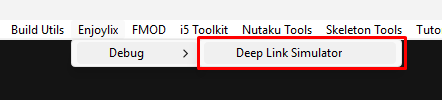
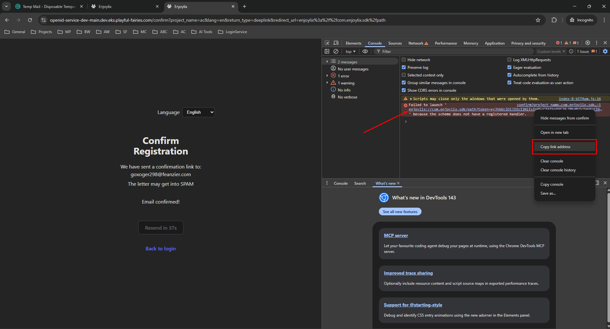
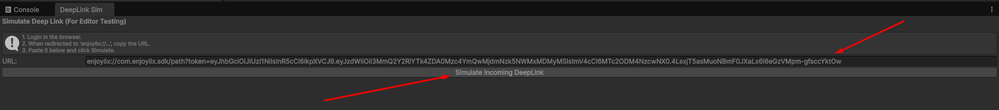

# Enjoylix Unity SDK

---

> 💡Tip: You can refer to our [GitBook](https://enjoylix.gitbook.io/docs) to get context of front-end and backend-end functions with Client side (Unity SDK)

---

Unity SDK for integrating Enjoylix OpenID authentication and Attribution into partner projects.

The SDK provides:

- Guest login
- OpenID login via browser
- Guest → OpenID account linking
- Attribution events (login / registration / purchase / tutorial)

---

## Supported Platforms

| Platform | Status |
| :---- | :---- |
| Android / iOS | ✅ |
| WebGL | ✅ |
| Unity Editor | ✅ |

### Platform Behavior

- **Mobile** — browser return via deeplink
- **WebGL** — browser return via `post_message`
- **Editor** — browser return via deeplink where you should use [Deep Link Simulator](#deep-link-simulation-editor-only)

---

## Installation

### Unity Package Manager (UPM)

Add the SDK to your `manifest.json` as a git dependency:

```json
{
  "dependencies": {
    "com.enjoylix.sdk": "https://github.com/enjoylix/unity-enjoylix-sdk.git#<tag>"
  }
}
```

Replace `<tag>` with any existing release tag from the repository's tags (e.g. `2.0.15`).

Alternatively, in Unity: `Window → Package Manager → + → Add package from git URL…` and paste
`https://github.com/enjoylix/unity-enjoylix-sdk.git#<tag>`.

> Unity needs a `git` executable available in `PATH`. The repository is public, no credentials are required.

---

## Configuration

### 1\. Create EnjoylixConfig

In Unity:

```
Assets → Create → Enjoylix → EnjoylixConfig
```

Fill in:

- `ProjectName`
- `Environment` (Dev / Prod)
- `DeepLinkScheme` (mobile only)
- `Environments Config:`
    - `BaseServiceUrl`: URL for Auth & Payment services.
    - `AttributionServiceUrl`: URL for Attribution events.

---

## SDK Initialization

The SDK must be initialized **once at application startup**.

```c#
public class EnjoylixBootstrap : MonoBehaviour
{
    [SerializeField] private EnjoylixConfig config;
    public static EnjoylixSdk Sdk;

    private async void Awake()
    {
        Sdk = new EnjoylixSdk(config);
        await Sdk.InitializeAsync();
    }
}
```

---

## Authentication

### Guest Login

```c#
string deviceId = SystemInfo.deviceUniqueIdentifier;
await EnjoylixBootstrap.Sdk.Auth.LoginGuestAsync(deviceId);
```

---

### OpenID Login (Browser)

```c#
var session = await EnjoylixBootstrap.Sdk.Auth.LoginOpenIdAsync();
```

---

### Link Guest → OpenID

```c#
string deviceId = SystemInfo.deviceUniqueIdentifier;
await EnjoylixBootstrap.Sdk.Auth.LinkGuestAsync(deviceId);
```

---

### Login with Existing Token

```c#
await EnjoylixBootstrap.Sdk.Auth.PerformLoginWithTokenAsync(accessToken);
```

---

### Logout

```c#
EnjoylixBootstrap.Sdk.Auth.Logout();
```

---

## Payments

The SDK handles the purchase flow via browser (similar to login).

### 1\. Ensure User can Purchase

Purchases require a full email login. You can check or force this state:

```c#
// Checks if user is authorized via Email. If Guest, triggers OpenID Login flow.
bool canBuy = await EnjoylixBootstrap.Sdk.EnsureEmailLoginAsync();
if (!canBuy) return; // User cancelled login
```

### 2\. Initiate Purchase

```c#
using EnjoylixSDK.Purchase.Models;

var request = new PurchaseCreateRequest
{
    coin_amount = 100,
    game_name = "my_game_project", // Agreed project name
    transaction_id = Guid.NewGuid().ToString("N"), // Your internal unique ID
    transaction_name = "Gold Pack Small",
    transaction_image_url = "https://mysite.com/gold.png"
};

// Opens browser, waits for payment, returns result
PaymentResult result = await EnjoylixBootstrap.Sdk.PurchaseCreateAsync(
    request, 
    TimeSpan.FromMinutes(5)
);

if (result.success)
{
    Debug.Log($"Purchase Successful! Payment ID: {result.payment_id}");
    
    // Optional: Manually complete/verify if needed immediately
    // await EnjoylixBootstrap.Sdk.Purchase.CompleteAsync(Sdk.Auth.AccessToken, result.payment_id);
}
else
{
    Debug.LogError($"Purchase Failed: {result.error}");
}
```

---

## Attribution

The SDK automatically tracks:

- `login` — after OpenID login
- `registration` — after guest → OpenID linking
- `ping` — session heartbeat: sent once an Enjoylix session exists (any entry path, including silent re-auth), then every 6 hours while the game is running (stops on `Logout()`)

On WebGL the query params the game was launched with (`?utm_source=facebook&utm_campaign=summer_sale`) are captured from the game url and sent both with attribution events and on the token request, so an in-game registration stays attributed to the campaign the player came from. No integration code required.

### Manual Tracking

```c#
EnjoylixBootstrap.Sdk.TrackTutorialComplete();
```

```c#
EnjoylixBootstrap.Sdk.TrackPurchase(
    "purchase:complete",
    "google_play",
    "checkout_1",
    "tx_123",
    4.99f,
    "USD",
    false
);
```

---

## Android Deeplink Setup

For mobile builds, add an intent-filter to `AndroidManifest.xml`.

Example:

```xml
<intent-filter>
    <action android:name="android.intent.action.VIEW"/>
    <category android:name="android.intent.category.DEFAULT"/>
    <category android:name="android.intent.category.BROWSABLE"/>

    <data
        android:scheme="enjoylix"
        android:host="com.enjoylix.sdk"
        android:pathPrefix="/path"/>
</intent-filter>
```

---

## iOS Deeplink Setup

For iOS builds, you must register the URL Scheme in Unity Player Settings:

1. Go to **Edit → Project Settings → Player → iOS tab**.
2. Expand **Other Settings**.
3. Scroll down to **Configuration → Supported URL schemes**.
4. Increase **Size** and add your scheme name (e.g., `enjoylix`).

*Note: Do not include `://` or the package name here, just the scheme word.*

---

## Deep Link Simulation (Editor Only)

Since the Unity Editor cannot natively intercept custom URL schemes (like `enjoylix://`), the SDK provides a helper tool to simulate the login callback manually.

**How to use:**

1.  In the Unity menu bar, go to **Enjoylix > Debug > Deep Link Simulator**.
    
2.  Dock the opened window somewhere convenient.
3.  Enter **Play Mode** and click **Standard Login**.
4.  Your default browser will open the auth page. Complete the login process. Confirm email.
5.  **Crucial Step**: When the browser redirects you to the final URL (e.g., `enjoylix://com.enjoylix.sdk/path?token=...`), copy this entire URL from the browser.
    *   *Note: The browser will likely show a "Page not found" or "Open application" error. This is normal. Just copy the url from DevTools Console.*
        
6.  Paste the URL into the **Deep Link Simulator** window.
7.  Click **Simulate Incoming DeepLink**.
    

The SDK will intercept this string as if it came from the OS, completing the login flow.

---

## Important Notes

- **WebGL** is the only platform using \`post\_message\`.
- **Android / iOS** requires a configured `DeepLinkScheme` to return from the browser to the game.
- **Unity Editor** is intended only for local testing via [Deep Link Simulator](#deep-link-simulation-editor-only).

---

## API Documentation

Full API reference is available in the [API Reference](Documentation~\API.md).
