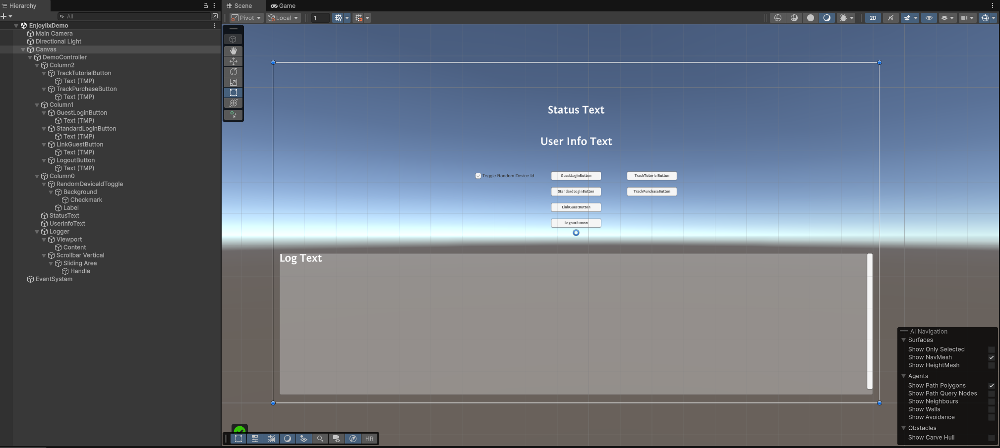

# Enjoylix SDK Demo

This sample demonstrates the core capabilities of the Enjoylix SDK, including Authentication flows (Guest, OpenID, Linking) and Attribution event tracking.

## Overview

The sample scene is pre-configured with a UI controller that interacts with the `EnjoylixSdk`. It allows you to test the entire user lifecycle from an anonymous guest to a fully authenticated user, as well as send telemetry events.

## Getting Started

1.  **Import the Sample**: Add this sample to your project via the Unity Package Manager.
2.  **Open the Scene**: Navigate to the sample folder and open `EnjoylixDemoScene`.
3.  **Check Configuration**:
   *   Select the **DemoController** object inside the **Canvas**.
   *   Ensure the `Config` field in the inspector is assigned with the provided **EnjoylixConfig** asset.
   *   *Note: If the TextMeshPro components are missing visually, please import "TMP Essentials" via `Window > TextMeshPro > Import TMP Essentials`.*

## Features & UI Controls

The sample scene consists of a pre-configured UI layout:

### 1. Authentication

The left column controls the user session.

*   **Toggle Random Device Id**:
   *   **Unchecked (Default)**: Uses `SystemInfo.deviceUniqueIdentifier`. This simulates a real user on a specific device.
   *   **Checked**: Uses a randomly generated UUID (GUID).
   *   *Logic*: The random ID is generated once when the scene starts. Toggling this allows you to switch between testing a "Real Device" and a "Fresh User" without clearing PlayerPrefs or changing devices.
*   **Guest Login**:
   *   Creates an anonymous session using the selected Device ID.
   *   Updates the **Status Text** to `Guest` and shows the Guest ID.
*   **Standard Login (OpenID)**:
   *   Initiates the browser-based login flow.
   *   On Mobile: Redirects back to the app via Deep Link.
   *   On WebGL: Communicates via window messages.
   *   In Editor: Opens the browser (requires manual [Deep Link Simulator](https://docs.google.com/document/d/1eqCjBolaVDt3eQUXsceUA0pbLgCyEEztNf9kpT_bcr0/edit?tab=t.0#heading=h.5y1snagpjmi5) tool to complete).
*   **Link Guest**:
   *   Active only when logged in as a Guest.
   *   Links the current anonymous progress to a permanent OpenID account.
*   **Logout**:
   *   Clears the session tokens and resets the state to `SignedOut`.

### 2. Payments

The middle column controls In-App Purchases.

*   **Buy 100 Coins**:
    *   Initiates a purchase flow for a virtual item.
    *   **Logic**:
        1. Checks if the user is logged in via Email. If not (Guest), it **automatically triggers** the OpenID Login flow first.
        2. Creates a transaction and opens the payment page in the browser.
    *   **Editor Testing**: Like login, the browser will redirect to a URL containing the result (e.g., `enjoylix://...?success=true&payment_id=...`). You must copy this URL into the **Deep Link Simulator** to complete the purchase in the Editor.

### 3. Attribution

The right column demonstrates event tracking.

*   **Track Tutorial**: Sends a `tutorial:complete` event to the server.
*   **Track Purchase**: Simulates a purchase event (e.g., "shop_gold_pack", $4.99) and sends it to the attribution service.
    *Note: This is just an event for analytics, not a real payment.*

### 4. Feedback

*   **Status Text**: Shows the current Auth State (`SignedOut`, `Guest`, `Authorized`).
*   **User Info Text**: Displays the User Email/ID (if authorized) or Guest ID.
*   **Log View**: The scrollable area at the bottom displays real-time SDK logs, token reception events, and error messages.

## Configuration Details

The sample includes pre-configured assets located in the sample folder:

1.  **EnjoylixConfig**: The main configuration object.
   *   **Project Name**: `test_game`
   *   **DeepLinkScheme**: `enjoylix://com.enjoylix.sdk/path`
   *   **Environment**: Defaults to `Dev`.
2.  **EnjoylixSandboxEnvironment**: Contains the API endpoints.
   *   **Auth**: `https://openid-service-dev-main.dev.eks.playful-fairies.com`
   *   **Attribution**: `https://attribution-service-dev-main.dev.eks.playful-fairies.com`

## Testing Notes

*   **Editor Testing**: When using **Standard Login** in the Unity Editor, the browser will open the login page. Since the Editor cannot automatically intercept custom URL schemes (Deep Links), the process may hang on the browser side. You may need to use a [Deep Link Simulator](https://docs.google.com/document/d/1eqCjBolaVDt3eQUXsceUA0pbLgCyEEztNf9kpT_bcr0/edit?tab=t.0#heading=h.5y1snagpjmi5) tool or copy the token manually for debugging.
*   **Mobile Testing**: Ensure your `DeepLinkScheme` matches the scheme defined in your Project Settings (Android Manifest / iOS URL Types) for redirects to work correctly.